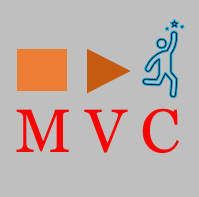

  

# MVC
My Video Community (MVC) is a project aiming to allow the creators to manage their customer relationship based in memberships and content

## Video NFT Smart Contract

Video NFTs Smart contract deployed to Goerli: 0x8ea11069484dA05d463946AFEDa9017503B30afA

## Livepeer content

I created a video NFT from an OBS Stream:

https://lvpr.tv?v=07e4qbatic91jcl6

## How it works

MVC empowers the creators, allowing them to create a better fans relationship and monetize their content through:
	
		- NFT Membership access model that allows:
			- Access a whitelist for exclusive events
			- Get notifications and updates about the livestream
			
		- Unblock content linked to the event when
			- The fan access to a number of events

This project enables the login and subscription with web3Auth, creates video NFTs with Livepeer, enables whitelists for events using contracts on Goerli.

